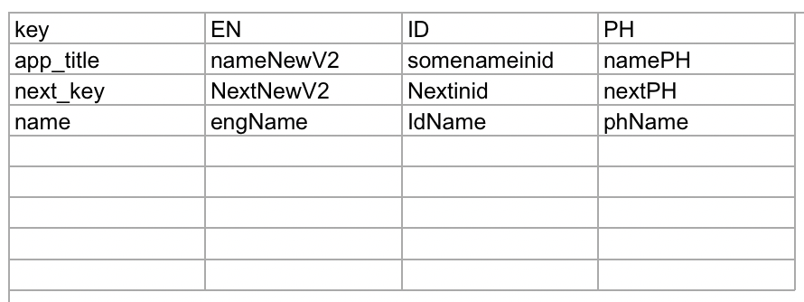

# android-translation-manager
(Currently in under development) A simple python script to reduce the manual work of entering translations for each language in android studio.

This Script read from Excel file and create values folder for each languge and write translation in string.xml from Excel file.

<B>Command: </B> <pre> py main.py android </pre>

<B> How it works: </B>
<UL>
  <li>create an excel file</li>
  <li>First column will contain the key's for respective Strings.</li>
  <li>Another column's will contain the translation string for each key respectively</li>
  <li>First row of each column will have the language code which should be same as the one used by android studio </li>
</UL>

<B> Sample Excel File: </B>

